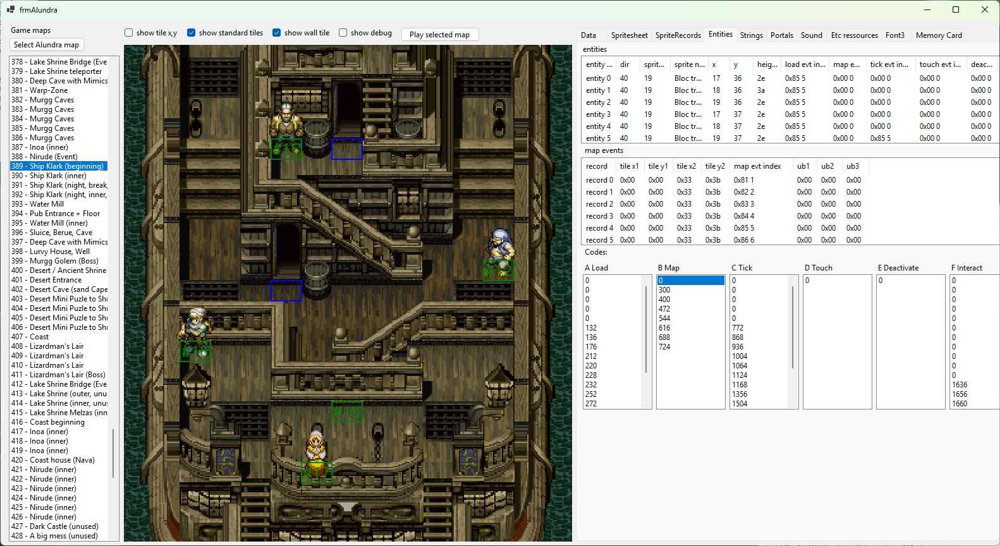
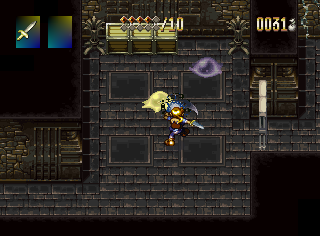
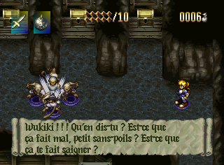
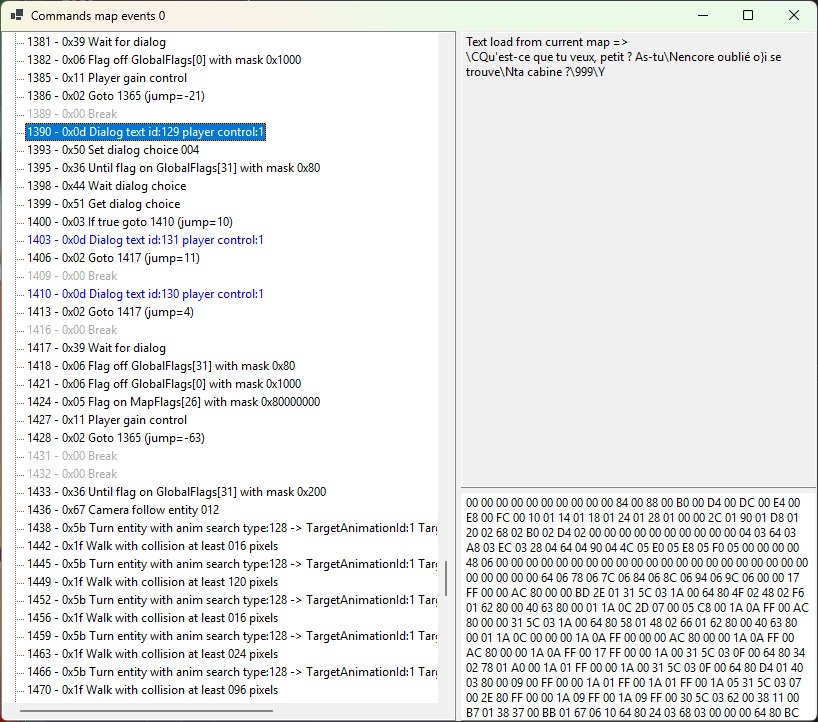
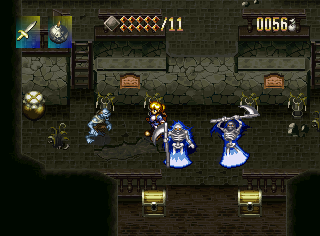
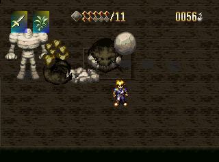
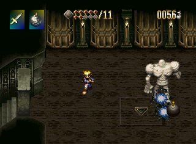

# Alundra Data‑Analyser

<p align="center">
  
  
  
</p>

> **Reverse‑engineering the original *Alundra* PlayStation game in C# and rebuild it with CasaEngineMonoGame. Based on [surixurient](https://github.com/surixurient/alundra)**

---

## Table of Contents

1. [Project Overview](#project-overview)
2. [Getting Started](#getting-started)
3. [Toolchain](#toolchain)
4. [Building & Running](#building--running)
5. [Ghidra](#ghidra)
7. [Contributing](#contributing)
8. [License](#license)
9. [Acknowledgements](#acknowledgements)
10. [Screenshots](#screenshots)


---

## Project Overview

This repository contains tools and documentation used to dissect the *Alundra* game assets, executable and logic.  Our long‑term goal is to achieve a faithful, open‑source re‑implementation using **CasaEngineMonoGame** while providing a clear legal and technical reference for researchers, modders and preservationists.

---

## Getting Started

### 1. Prerequisites

| Software           | Minimum version | Notes                                  |
| ------------------ | --------------- | -------------------------------------- |
| .NET SDK           | **9.0**         | Build the C# tooling & CasaEngine fork |
| Ghidra             | **12.0.1**      | Static analysis of the original ELF    |
| PCSX‑Redux         | Latest          | Debugging the PS‑One ROM in real time  |
| Visual Studio      | 2026            | Recommended IDE (optional)             |
| MonoGame           | **3.8**         | Game engine used for the remake        |

> **Legal note** – You must own a legitimate copy of the original *Alundra* disc to extract and analyse game data.  No copyrighted assets are distributed in this repository.

### 2. Installation

```bash
# Clone the repo with sub‑modules (CasaEngine fork)
$ git clone --recursive https://github.com/your-org/alundra-datas-analyser.git

# Restore .NET dependencies
$ dotnet restore
```

### 3. Quick Start

1. Dump all data from your own disc image.
2. Launch the AlundraTools.exe
3. You can open the Datas.bin to see maps and assets
4. You can play the game (work in progress). Only used to test the game engine.

---

## Toolchain

| Component              | Purpose                                             |
| ---------------------- | --------------------------------------------------- |
| **AlundraTools**       | Visual exploration of tilesets, sprites & maps      |
| **CasaEngineMonoGame** | Cross‑platform runtime for the in‑progress remake   |
| **Scripts/**           | Python helpers (data extraction, format conversion) |
| **PCSX‑Redux**         | Emulator with symbol loading & memory watch windows |
| **Ghidra project**     | Decompilation workspaces and function labels        |

---

## Building & Running

```bash
# Build all C# projects in Release configuration
$ dotnet build -c Release

# Run the remake prototype (loads external assets)
$ dotnet run --project AlundraTools
```

The prototype currently boots into the intro map and allows basic movement.

---

## Ghidra

The analyze has been done with the french version of Alundra.

---

## Contributing

We welcome pull requests, bug reports and feature proposals.  Please follow these steps:

1. **Fork** the repository and create your feature branch: `git checkout -b feat/my‑feature`.
2. **Commit** your changes with clear messages and run `dotnet test`.
3. **Open a Pull Request** against the `main` branch and fill in the PR template.
4. A maintainer will review; please be ready to revise.

Coding style is enforced via `EditorConfig` and `dotnet format`.  Large binary files should **not** be committed – use Git LFS if absolutely necessary.

---

## License

Source code is released under the **MIT License**.  Original *Alundra* assets remain the property of their respective rights holders and are **not** included in this repository.

---

## Acknowledgements

* Matrix Software & Sony for creating the original game.
* The **PCSX‑Redux** team for their excellent debugging emulator.
* Contributors to **CasaEngine** for sharing their engine with the community.
* Other project: Alundra PC portage [Alundra Toolkit](https://github.com/Sunnnix/AlundraToolkit)

---

## Screenshots

<p align="center">
  
  
  
  
  
  
  
</p>